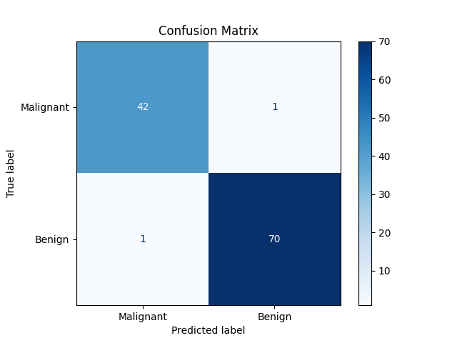
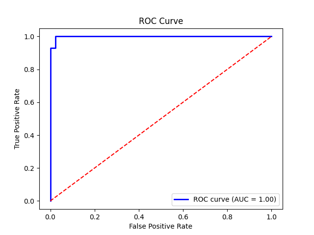
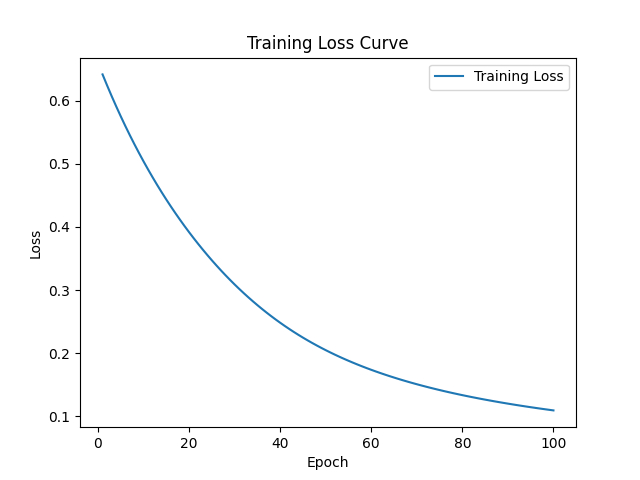
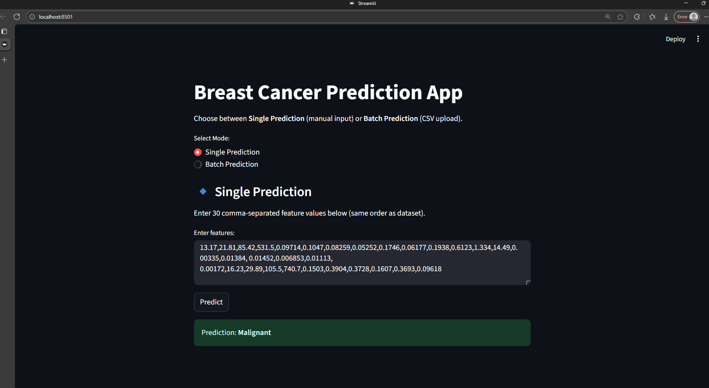
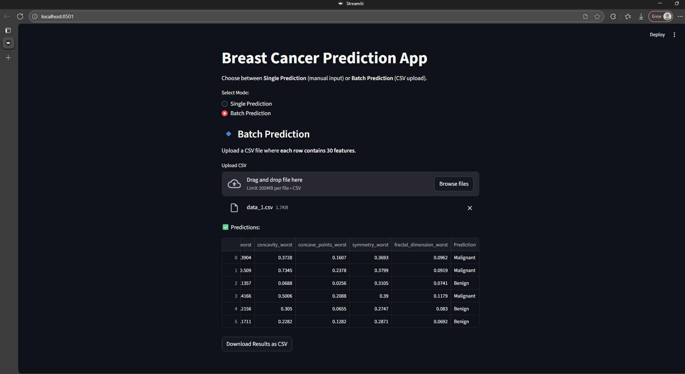

# Breast Cancer Prediction – PyTorch + Streamlit (End-to-End)

This project provides a complete end-to-end solution for breast cancer prediction, classifying tumors as Benign or Malignant using PyTorch, and includes an interactive Streamlit app for both single and batch data input predictions.

---

## 📑 Table of Contents
- <a href="#overview">Overview</a>
- <a href="#problem-statement">Problem Statement</a>
- <a href="#dataset">Dataset</a>
- <a href="#project-structure">Project Structure</a>
- <a href="#tools--technologies">Tools & Technologies</a>
- <a href="#methods">Methods</a>
- <a href="#key-insights">Key Insights</a>
- <a href="#model--output">Model / Output</a>
- <a href="#how-to-run-this-project">How to Run This Project</a>
- <a href="#results--conclusion">Results & Conclusion</a>
- <a href="#future-work">Future Work</a>
- <a href="#author--contact">Author & Contact</a> 

---
<h2><a class="anchor" id="overview"></a>📖 Overview</h2>

This project provides a complete workflow for breast cancer prediction. It covers:
1. Data loading and preprocessing  
2. Building and training a neural network using PyTorch  
3. Evaluating the model (accuracy, confusion matrix, ROC curve, training curve)  
4. Testing the model on new data  
5. Deploying an interactive Streamlit app for single and batch predictions 

---
<h2><a class="anchor" id="problem-statement"></a>❓ Problem Statement</h2>

Breast cancer detection at early stages can save lives. This project aims to classify tumors as **Benign** or **Malignant** using medical features. The Streamlit app ensures correct real-world labels for new input.

---
<h2><a class="anchor" id="dataset"></a>📊 Dataset</h2>

- **Dataset:** Wisconsin Breast Cancer Dataset (from sklearn)  
- **Features:** 30 numeric features  
- **Labels:** 0 = Malignant, 1 = Benign (for model training)
- **Note:**  
The Streamlit app adjusts predictions as:
```python
prediction = "Benign" if probability >= 0.5 else "Malignant"
```
This ensures predictions match real-world labels while model training uses sklearn labels.

---
<h2><a class="anchor" id="project-structure"></a>📂 Project Structure</h2>

```
breast-cancer-prediction-pytorch-streamlit/
│
├── Notebooks/
│    └── breast_cancer_model.ipynb           # Complete workflow from loading data to testing
│
├── Scripts/
│    └── app_streamlit.py                    # Streamlit app for interactive single/batch file input prediction
│
├── Outputs/
│    ├── confusion_matrix.png
│    ├── roc_curve.png
│    ├── training_curve.png
│    ├── streamlit_single_input.png
│    └── streamlit_csv_input.png
│
├── requirements.txt                         # Project dependencies
└── ReadMe.md                                # Detailed project documentation

```

---
<h2><a class="anchor" id="tools--technologies"></a>🛠 Tools & Technologies</h2>

- Python 3.9+
- PyTorch
- scikit-learn
- pandas & numpy
- matplotlib
- Streamlit
- joblib

---
<h2><a class="anchor" id="methods"></a>🔎 Methods</h2>
   
1. Data Preprocessing: Standardization using ```StandardScaler```
2. Neural Network Architecture:
   - Input layer: 30 features
   - Hidden layer: 64 neurons + ReLU activation
   - Output layer: 1 neuron + Sigmoid activation
3. Loss Function: Binary Cross Entropy
4. Optimizer: Adam
5. Training: 100 epochs
6. Evaluation:
   - Accuracy
   - Confusion Matrix
   - ROC Curve & AUC
   - Training Loss Curve
7. Deployment: Streamlit app for:
   - Single input (30 features comma-separated)
   - Batch input (CSV with multiple rows) 
 
---
<h2><a class="anchor" id="key-insights"></a>📈 Key Insights</h2>

- Model achieved ~97% test accuracy
- ROC curve shows excellent separation (AUC > 0.98)
- Most important features include mean radius, worst area, concavity
- Streamlit app provides easy-to-use interface for real-world predictions 

---
<h2><a class="anchor" id="model--output"></a>📊 Model / Output</h2>

- **Confusion Matrix:**  

    

- **ROC Curve:**  

    

- **Training Loss Curve:**

  

- **Streamlit app single input view:**  

    

- **Streamlit app batch CSV input view:**

  

---
<h2><a class="anchor" id="how-to-run-this-project"></a>🚀 How to Run This Project</h2>

### 🔧 Step 1: Clone Repository

```bash
git clone https://github.com/<username>/breast-cancer-prediction-pytorch-streamlit.git
cd breast-cancer-prediction-pytorch-streamlit
```

### 🔧 Step 2: Install Dependencies

```bash
pip install -r Requirements.txt
```

### 🔧 Step 3: Run Jupyter Notebook

Open ```Notebooks/breast_cancer_model.ipynb in Jupyter or Colab ```
- This notebook covers the full workflow: model building and evaluation predictions

### 🔧 Step 4: Run Streamlit App

```bash
streamlit run Scripts/app_streamlit.py
```

- Single Prediction: Enter 30 features comma-separated
- Batch Prediction: Upload CSV with multiple rows
- Output shows Benign / Malignant predictions interactively 

--- 
<h2><a class="anchor" id="results--conclusion"></a>✅ Results & Conclusion</h2>

- Model demonstrates high accuracy (~97%) on test data
- Confusion matrix and ROC curve validate reliability
- Streamlit app provides real-time predictions for users 

---
<h2><a class="anchor" id="future-work"></a>🔮 Future Work</h2>

- Feature importance visualization for explainability
- Deploy full web app with backend database
- Test alternative models (XGBoost, Random Forest) for comparison

---
<h2><a class="anchor" id="author--contact"></a>👨‍💻 Author \& Contact</h2>

👤 **Golla Sai Deep**

Aspiring Data Scientist

📧 Email: saideepcct@gmail.com

[](https://github.com/saideep-21)

[](https://www.linkedin.com/in/saideep04)  


